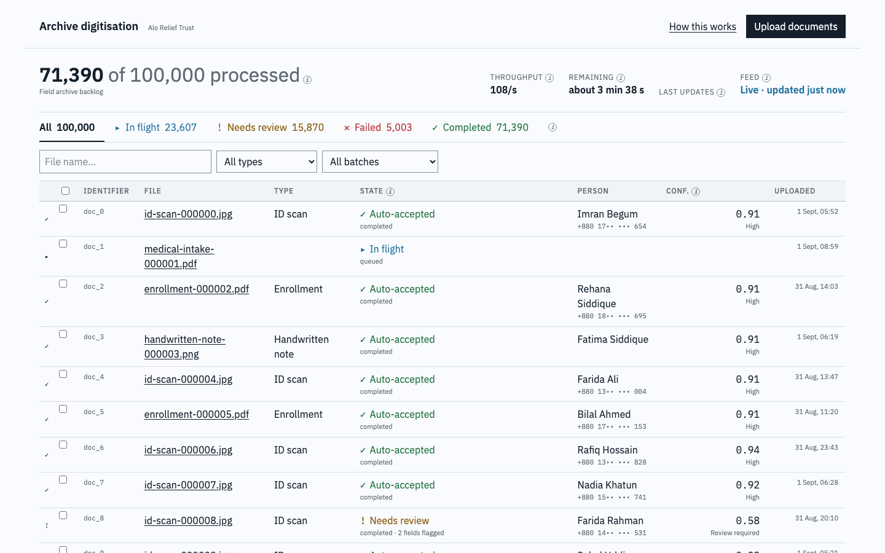
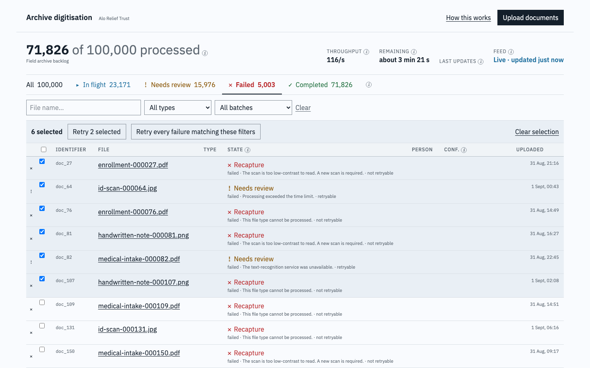
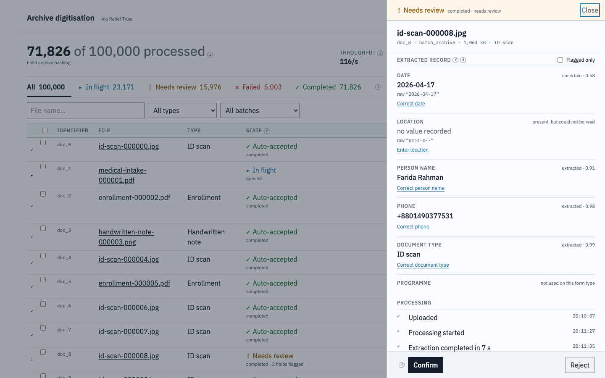
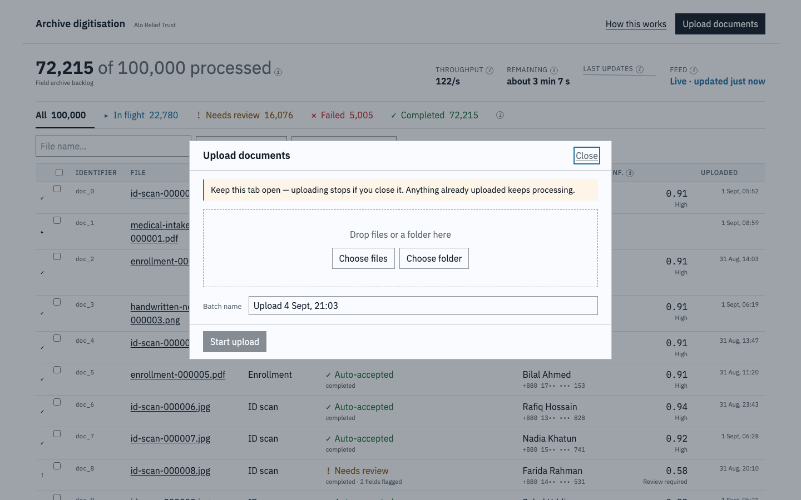
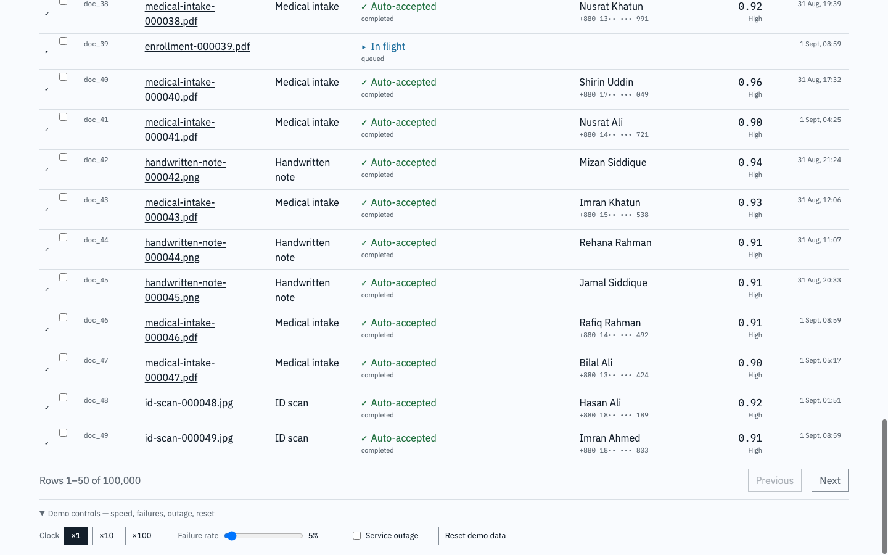
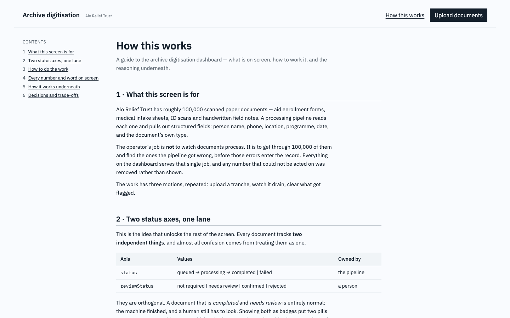
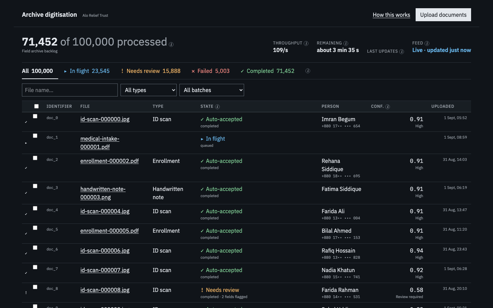

# Archive digitisation — document processing prototype

A frontend prototype for Alo Relief Trust: upload up to ~100,000 scanned aid documents, watch an
extraction pipeline work through them, and find the ones it got wrong before those errors enter
the record.

Built for the Chromatics AI senior frontend assessment. There is no backend — the API is
simulated in the browser by a service worker, and the same handlers serve the test runner.

> **Start with the in-app guide.** Run the app and click **How this works** in the top bar (or go
> to `/guide`). It explains the screen, walks through the six tasks, and covers the architecture
> and the decisions behind it. Every ambiguous label on the dashboard also carries an ⓘ that
> explains it on hover.

---

## Running locally

Node 22+ and pnpm.

```bash
pnpm install
pnpm dev          # http://localhost:5173
```

| Command | What it does |
|---|---|
| `pnpm dev` | Dev server with the mock backend |
| `pnpm test` | 198 tests (Vitest; jsdom per-file where a DOM is needed) |
| `pnpm typecheck` | `tsc -b` |
| `pnpm lint` | oxlint |
| `pnpm build` | Production build |
| `pnpm format` | Prettier |

First load generates 100,000 documents from a seed (~70 ms) and registers a service worker. If
the dashboard looks empty on the very first load, reload once — the worker needs one navigation
to take control.

**Try these three things**, in order. They cover most of what the prototype does:

1. Click **Needs review**, open a flagged row, correct a field, press Confirm.
2. Click **Failed**, tick six rows, and watch the bar offer to retry only the retryable ones.
3. Open **Demo controls** at the bottom, set the clock to ×100, and watch the backlog drain.

---

## Product assumptions

The brief leaves a lot open. These are the calls this prototype makes; each is a decision, not an
oversight.

1. A batch represents a single upload operation and may contain thousands of documents.
2. The backend owns the dataset. The frontend never loads all 100,000 documents into memory.
3. Processing is asynchronous and status updates are eventually consistent.
4. Confidence below a threshold puts a document into a review state.
5. Missing fields are distinct from failed processing.
6. Retry operates on failed documents without creating duplicates.
7. Search and filtering are server-side operations.
8. The prototype uses mocked APIs and deterministic fixtures to simulate production-scale behaviour.
9. Upload and processing are separate stages with separate failure modes. An upload failure never
   creates a document.
10. Documents are heterogeneous. The normalised record is a fixed core schema, and fields not
    expected for a document type are `not_applicable`, not missing.
11. Normalised values are shown alongside raw OCR text when the two differ. The raw text is the
    audit trail.
12. Document confidence is the **minimum** of the confidences of fields that carry one, not an
    average — an average lets one badly-read field hide behind five clean ones.
13. Errors are classified retryable or not, and the UI never offers a retry for a non-retryable
    failure.
14. Human rejection is distinct from system failure, and is excluded from "retry all failed".
15. Filters, sort, page and the open document live in the URL.
16. The dataset is in memory and resets on reload. Production would persist queue state client-side
    and use resumable uploads, given field-team connectivity.
17. Phone numbers are masked in list views because the archive holds medical and identity documents.

---

## Domain model

Two **independent** axes per document. Conflating them is the single biggest source of confusion
in this problem space.

| Axis | Values | Owned by |
|---|---|---|
| `status` | `queued` → `processing` → `completed` \| `failed` | the pipeline |
| `reviewStatus` | `not_required` \| `needs_review` \| `confirmed` \| `rejected` | a person |

A document that is `completed` **and** `needs_review` is entirely normal. Rather than show two
badges per row, the table shows one derived **lane** — the answer to "what do I do with this?" —
with the raw pair beneath it in small text:

| | Lane | Meaning |
|---|---|---|
| `▸` | **In flight** | Queued or processing |
| `✓` | **Auto-accepted** | Finished, confident, nothing flagged |
| `!` | **Needs review** | A flagged field, **or** a retryable failure |
| `✕` | **Recapture** | A dead-end failure, or a human rejection |

A retryable failure is routed to *Needs review* rather than to the other failures on purpose: it
needs one human click, so it belongs in the attention bucket, not the write-off bucket.

**Per-field status** has six values, never collapsed into a dash: `extracted`, `uncertain`,
`missing`, `unreadable`, `not_applicable`, `corrected`. A blank value is therefore never ambiguous
between "not on the form", "we could not read it" and "this form type has no such field". Taken
from archival condition-survey practice, where grading an item "good/fair/poor" is treated as
useless and the specific defect is recorded instead.

Everything derived — the lane, document confidence, the confidence band, which fields are flagged
— lives in `src/domain/derive.ts` as pure functions, and the legal moves live in
`src/domain/transitions.ts`. Both are tested exhaustively, and the UI reads its available actions
from `can()` in that same table, so it can never offer a move the server would reject with a 409.

---

## Architecture and state management

```
src/
  app/         router, URL search-param schema
  domain/      types · transitions · derive        (pure, no React, no I/O)
  api/         client · queries · mutations         (the only place that talks HTTP)
  mocks/       generate · clock · overlay · store · handlers
  features/
    dashboard/ StatsStrip · FilterBar · DocumentsTable · SelectionBar · StatusMark
    document/  DocumentDrawer · FieldList · ReviewActions · ProcessingTimeline
    upload/    UploadDialog · QueueList · queue · traverse · validate
    guide/     Guide                                 (the in-app manual)
    sim/       DevPanel
  components/  InfoTip
  lib/         format · labels · glossary
```

**Server state** is TanStack Query. The list query is keyed on the URL search params, keeps the
previous page on screen while the next loads, and polls only while something is actually queued or
processing — a dashboard that polls a finished archive forever is the easiest way to make a
prototype feel broken.

**UI state** is the URL, via typed search-param schemas. Filters, sort, page and the open document
are all in the query string, so any view is a shareable link, survives a reload, and the back
button undoes a filter. There is no global store; component state covers dialogs and selection.

**Feature components are router-free**, so they render in tests without one. Routing is wired at
the edges.

---

## Large dataset strategy

The frontend never sees 100,000 documents. It sees a page of 50.

- **Server-side everything** — filtering, search, sort and paging all happen behind the API. The
  client sends query params and renders what comes back.
- **Filter on cheap derived state, materialise only the page.** Building full documents for every
  match and then filtering cost 65 ms per request on the main thread; this costs about 6 ms.
- **Lazy extraction.** A document's extracted fields are generated from its id only when something
  asks for them.
- **The upload queue renders only its visible window.** Rows are a fixed height, so that is roughly
  twenty lines rather than a virtualisation dependency.

Measured at 100,000 documents: **71 ms** to generate the archive, **6 ms** for a filtered page,
**5 ms** for batch statistics. Asserted in the test suite, not just observed.

---

## Async simulation

The interesting decision in this repo.

Rather than a scheduler mutating records on a timer, **status is a pure function of a virtual
clock**. Every document carries a start offset and a duration and a seeded outcome; it is queued
before it starts, processing between, and its outcome after.

Three things fall out of that:

- 100,000 documents advance with **zero writes**, so nothing has to be paged, batched or debounced.
- A **reload resumes exactly where it left off**, because the clock accumulates elapsed time rather
  than reading from a fixed origin.
- The **speed can be changed without rewriting the past** — ×100 fast-forwards, and what already
  happened stays happened.

Only human decisions, retries and simulation settings are persisted (one debounced blob in
IndexedDB). The 100,000 base records are never stored; they are regenerated from the seed. The
stored patch type is *structurally unable* to hold a status or a timestamp, which is what stops a
retried document being frozen in the state it had when it was written.

`DevPanel` exposes the clock speed, the failure rate, a transport-level outage and a reset, so
every state this interface can show is reachable in about thirty seconds.

---

## API contract

Origin-agnostic paths, so one set of handlers serves the browser (relative fetch) and the Node test
runner (absolute fetch).

| Method | Path | Purpose |
|---|---|---|
| `GET` | `/api/documents` | Paged list. `q`, `status[]`, `review[]`, `type[]`, `batch`, `sort`, `page`, `pageSize` |
| `GET` | `/api/documents/:id` | One document with its extraction |
| `POST` | `/api/documents/:id/retry` · `/confirm` · `/reject` | Single-document transitions; `409` on an illegal move |
| `PATCH` | `/api/documents/:id/fields/:field` | Correct one field |
| `POST` | `/api/documents/retry` | Filter-scoped bulk retry; returns `{ affected }` |
| `GET` | `/api/batches` · `/api/batches/:id` | Batch counts, throughput, ETA |
| `POST` | `/api/batches` · `/api/batches/:id/documents` | Create a batch; register uploaded files (idempotent on client key) |
| `GET`/`PATCH` | `/api/sim`, `POST /api/sim/reset` | Simulation controls |

Every read has 80–250 ms of latency so loading states are real, and the outage switch fails reads
at the transport level so the error paths are real too.

---

## UX decisions

- **One lane column, not two badges.** Two pills per row across thirty rows is unreadable.
- **A flagged row names the field at fault** — `completed · date unreadable`, not `needs review`.
  Without it, "Needs review" beside a confidence of `0.97 High` reads as a contradiction: the
  document is flagged for a field that carries no confidence at all.
- **Colour is reserved for state.** There is no brand accent hue; actions are ink on paper. Every
  status is drawn as a glyph *and* a word, because the five status colours sit within 20% relative
  luminance of each other by design. The palette was computed and verified against contrast ratios
  rather than chosen by eye.
- **Fields are ordered worst-first**, `uncertain` leading. A value that is present and wrong is the
  failure this product exists to prevent; an unreadable field is at least obviously empty.
- **Buttons are absent, not disabled**, when a move is illegal — a disabled button invites a click
  that can never work.
- **The bulk bar counts what will actually move.** Six selected can offer "Retry 2 selected",
  because only two are retryable. It promises no count for the filter-scoped action, because the
  archive cannot count "retryable failures within an arbitrary filter" without fetching them all —
  it reports what actually moved instead.
- **A `not_applicable` field offers no correction affordance.** Inviting someone to fill it in is
  inviting bad data.

---

## Accessibility

- Every status is **glyph + word + colour**, never colour alone (WCAG 2.2 SC 1.4.1).
- Real `<table>` semantics with `<th scope>`, `aria-sort` on sortable headers, and a caption.
- The drawer and both dialogs are native `<dialog>` with `showModal()`, so the focus trap, the
  inert background and Escape are the platform's. Focus returns to the row the drawer came from.
- Tooltips open on **hover, focus and tap**, are dismissible with Escape, and stay open while the
  pointer travels into them (SC 1.4.13).
- Throttled `aria-live="polite"` regions for upload progress and the row range; upload progress is
  announced at deciles rather than per file.
- Visible focus rings; input borders and focus rings clear 3:1 in both colour schemes.
- Full light and dark support driven by `prefers-color-scheme`.

---

## Trade-offs

**What was deliberately not installed.** A charting library (the sparkline is one `<polyline>`), a
table library (sorting, filtering and paging are all server-side), a component library, a dialog
library (native `<dialog>`, three times) and a virtualiser (fixed row heights make the window a
subtraction). The dependency list is React, TanStack Router, TanStack Query, and two fonts.

**Test strategy.** 198 tests, written before the code at each milestone. Domain logic and the mock
backend are tested in Node; components opt into jsdom per file. No Playwright — but jsdom has no
pointer and no `showModal`, so anything resting on those is checked by driving a real Chrome over
CDP (`scripts/drive.mjs`). That is not decoration: three real bugs shipped past a green test suite
and were caught only in a browser.

**What that cost.** Bulk retry is not optimistic — predicting thousands of rows client-side to save
one round trip is a lot of machinery for a button pressed once. Selection is page-scoped. The
"retry all matching" action cannot show a count before you press it.

---

## Known limitations

- **Uploaded documents live in memory only.** A reload loses them, and loses an upload queue that
  is still running. Production needs resumable uploads and a persisted queue.
- **No accounts and no roles.** Masking the phone number in the table is a sensible default, not a
  permission boundary.
- The **sparkline is measured in the browser tab** and resets on reload; there is no history
  endpoint behind it.
- The **count chips filter on raw status and review, not on lane** — the API has no lane axis, and
  the Needs-review lane is wider than the Needs-review chip.
- **Nothing here performs OCR.** Outcomes are seeded. The subject is the operator's workflow around
  a pipeline, not the pipeline.
- Handlers run on the main thread, since MSW forwards to the page. At 100k that is a ~6 ms budget
  per request, which holds; a real backend removes the question.

---

## Next steps

1. **Resumable uploads and a persisted queue** — the single biggest gap for field teams on poor
   connectivity.
2. **Lane-aware server filters.** Adding lane counts to batch statistics and a lane filter to the
   list endpoint would let the chips and the table finally agree.
3. **Keyboard-first review.** An operator clearing 4,000 flagged documents wants `j`/`k` and a
   one-key confirm, not a mouse.
4. **Real auth and field-level redaction**, replacing the masking default.
5. **A history endpoint** so throughput survives a reload.

---

## Screenshots

| | |
|---|---|
|  | **Dashboard.** Headline counts, throughput and ETA, filter chips, and the register — one lane column per row with the raw state beneath it. |
|  | **Bulk retry.** Six rows selected, and the bar offers to retry **two** — only those two are retryable failures. The rest need a fresh capture. |
|  | **Detail drawer.** Fields worst-first, each defect stated in words, raw OCR text beneath the normalised value, and only the actions the transition table allows. |
|  | **Upload.** Files, folder, or a dropped folder walked recursively; validation summary before anything is sent; aggregate progress first, queue underneath. |
|  | **Demo controls.** Clock speed, failure rate, a transport-level outage, and reset — every state reachable in thirty seconds. |
|  | **The in-app guide** at `/guide`, linked from the top bar. |
|  | **Dark scheme**, driven by `prefers-color-scheme`. |

---

## Where the reasoning lives

| Document | What is in it |
|---|---|
| `/guide` (in the app) | The manual: the screen, six walkthroughs, the full reference, architecture, decisions |
| `docs/adr/0001-prototype-foundations.md` | The six foundational decisions |
| `docs/superpowers/specs/2026-09-04-doc-processing-prototype-design.md` | The technical design the code was built to |
| `docs/design/direction.md` | The design direction, with cited sources |
| `docs/TRACKER.md` | Milestone board, and a running log of every deviation from the plan and why |
